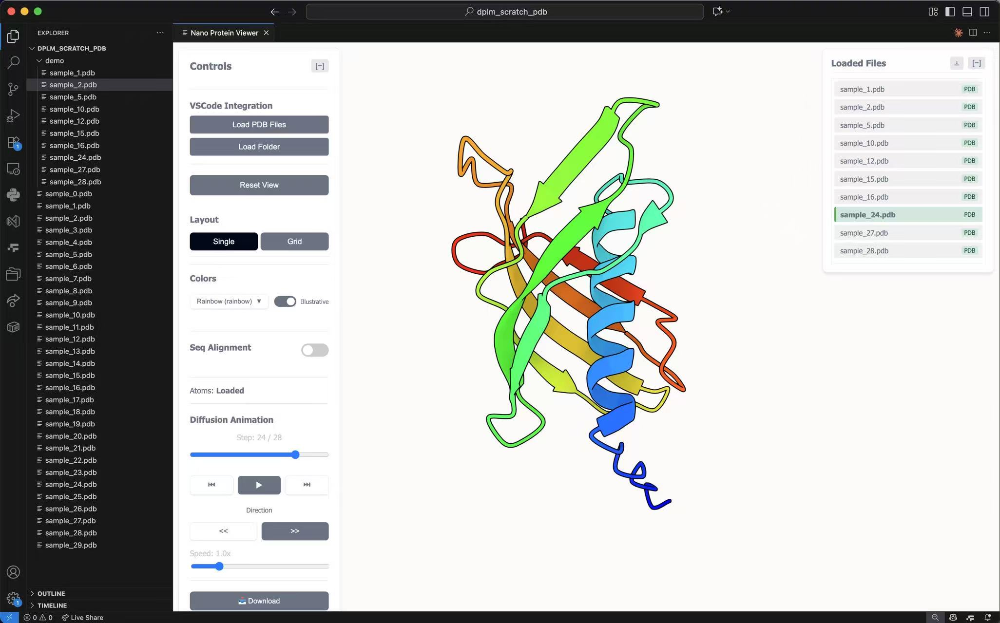
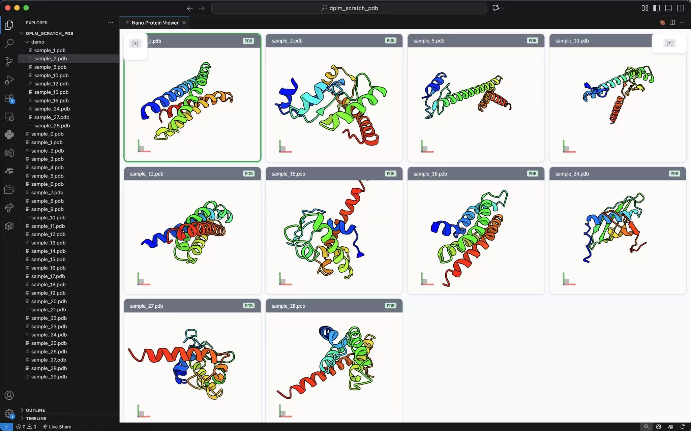
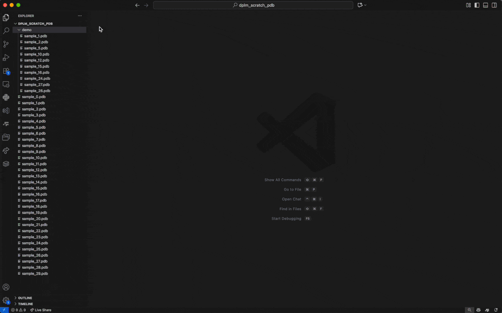

# Nano Protein Viewer VSCode Extension


A simple but powerful VSCode extension for visualizing protein structures using the Molstar framework, featuring advanced capabilities for sequence alignment, diffusion animations, and confidence scoring.

## Features

### Single view mode


### Grid view mode


### Usage demo


### 🧬 Protein Structure Visualization
- **Multi-Format Support**: Load and visualize molecular structures from PDB, mmCIF, PDBQT, GRO, XYZ, MOL, MOL2, and SDF files
- **Interactive 3D Viewer**: Powered by Molstar for high-performance molecular visualization
- **Multiple Color Schemes**: Custom colors, element-based, residue-based, and chain-based coloring
- **Grid View**: Display multiple structures simultaneously in a grid layout

### 🔄 Diffusion Animation Support
- **Sequence Loading**: Load entire folders of structure files as diffusion sequences
- **Animation Controls**: Play, pause, step through frames with speed control
- **Download Animations**: Export animations as video files or frame sequences

### 🧪 Sequence Alignment & Prediction
- **FASTA Support**: Load and parse FASTA sequence files
- **ESMFold Integration**: Fold protein sequences using ESMFold API
- **Dual Session Mode**: Compare original and predicted structures side-by-side
- **pLDDT Confidence Coloring**: Visualize prediction confidence with color coding
- **Alignment Tools**: Manual alignment mode with RMSD calculation

### 🎨 Advanced Visualization
- **Cartoon Representation**: Optimized cartoon rendering for clear structural visualization
- **Confidence Coloring**: pLDDT confidence scores with color legend
- **Interactive Controls**: Collapsible panels, zoom, rotate, translate
- **Multiple Layout Modes**: Single view, dual session, grid view

## Installation

1. Open VSCode
2. Go to Extensions (Ctrl+Shift+X / Cmd+Shift+X)
3. Search for "Nano Protein Viewer"
4. Click Install

## Usage

### Basic Usage

1. **Open Command Palette**: `Ctrl+Shift+P` (Windows/Linux) or `Cmd+Shift+P` (Mac)
2. **Run Command**: Type "Nano Protein Viewer" and select "Open Nano Protein Viewer"
3. **Load Files**: Use the VSCode integration buttons to load structure files, folders, or FASTA sequences

### Context Menu Integration

- **Right-click structure files**: Select "Launch Nano Viewer from file(s)" 
- **Right-click folders**: Select "Load Folder in Nano Viewer" to load as diffusion sequence
- **Right-click FASTA files**: Select "Load FASTA in Nano Viewer"

### Commands

- `nano-protein-viewer.start`: Open the protein viewer
- `nano-protein-viewer.loadPDBFiles`: Launch Nano Viewer from file(s)
- `nano-protein-viewer.loadFolder`: Load folder as diffusion sequence
- `nano-protein-viewer.loadFASTA`: Load FASTA file

### Loading Structure Files

1. **Single Files**: Use "Load Structure Files" button or right-click context menu
2. **Multiple Files**: Select multiple structure files to load simultaneously
3. **Folder Loading**: Load entire folders for diffusion sequence animations

### Sequence Alignment Workflow

1. **Enable Sequence Alignment**: Toggle the "Seq Alignment" switch in the control panel
2. **Load FASTA**: Either upload a FASTA file or paste sequences directly
3. **Fold Sequences**: Use "Fold All with ESMFold" to generate 3D structures
4. **Compare Structures**: Switch between display modes:
   - **Dual Session**: Original structure (left) vs predicted (right)
   - **Seq Structure Only**: Show only predicted structure
   - **Align Mode**: Both structures in single session for manual alignment

### Animation Controls

When loading diffusion sequences:
- **Play/Pause**: Control animation playback
- **Step Controls**: Navigate frame by frame
- **Speed Control**: Adjust playback speed (0.1x to 5.0x)
- **Direction**: Play forward or backward
- **Download**: Export animations as video files or frame sequences

### Color Schemes

- **Custom**: Choose from predefined color palette
- **Element**: Color by chemical element
- **Residue**: Color by amino acid residue type
- **Chain**: Color by protein chain
- **Rainbow**: Color by sequence position with multiple palette options
  - Classic: Traditional rainbow gradient
  - Viridis: Perceptually uniform colormap
  - Plasma: High contrast plasma colormap
  - Magma: Warm magma colormap
  - Blue-Red: Simple blue to red gradient
  - Pastel: Soft pastel colors
- **pLDDT Confidence**: Automatic for predicted structures
  - Blue: Very High confidence (>90)
  - Light Blue: Confident (70-90)
  - Yellow: Low confidence (50-70)
  - Orange: Very Low confidence (<50)

### Illustrative Style

Toggle illustrative rendering for enhanced visual quality:
- **Outline Effect**: Adds edge outlines to structures for better definition
- **Ambient Occlusion**: Adds depth perception with shadowing in cavities
- Creates publication-quality visualizations with improved depth and clarity

## Requirements

- VSCode 1.62.0 or higher
- Internet connection for Molstar CDN resources
- Optional: Internet connection for ESMFold API

## Configuration

The extension works out of the box with no additional configuration required. All settings are managed through the interactive control panel within the viewer.

## Supported File Formats

- **Structure Files**: `.pdb`, `.PDB`, `.cif`, `.CIF`, `.mmcif`, `.MMCIF`, `.pdbqt`, `.PDBQT`, `.gro`, `.GRO`, `.xyz`, `.XYZ`, `.mol`, `.MOL`, `.mol2`, `.MOL2`, `.sdf`, `.SDF`
- **Sequence Files**: `.fasta`, `.FASTA`, `.fa`, `.FA`, `.fas`, `.FAS`

## Keyboard Shortcuts

- **Arrow Keys**: Navigate between loaded files
- **Mouse Controls**: 
  - **Left Click + Drag**: Rotate structure
  - **Right Click + Drag**: Translate structure
  - **Mouse Wheel**: Zoom in/out
  - **Shift + Mouse Wheel**: Adjust clipping planes

## Tips & Tricks

1. **Performance**: Use grid view for comparing multiple structures efficiently
2. **Large Files**: The viewer handles large protein complexes well due to Molstar's optimization
3. **Sequence Matching**: The extension automatically attempts to match sequence names with loaded structure files
4. **Confidence Colors**: pLDDT coloring is automatically applied to ESMFold predictions
5. **Animation Performance**: Adjust animation speed for smooth playback on different hardware

## Troubleshooting

### Common Issues

1. **Viewer Not Loading**: Check internet connection for Molstar CDN resources
2. **File Format Errors**: Ensure files are valid molecular structure format
3. **ESMFold Errors**: Check sequence length (10-1000 amino acids) and internet connection
4. **Performance Issues**: Close unused grid viewers or reduce animation speed

### Error Messages

- **"Invalid structure file"**: File format is not recognized or corrupted
- **"No valid structures found"**: No structure files in selected folder
- **"ESMFold API error"**: Network issue or invalid sequence
- **"Sequence too short/long"**: ESMFold requires 10-1000 amino acids

## Contributing

This extension is based on the Molstar framework. For issues or feature requests, please check the repository or create an issue.

## License

MIT License - see LICENSE file for details.

## Citation

If you use this extension in your research, please cite the underlying Mol* framework:

```bibtex
@article{sehnal2021molstar,
    author = {Sehnal, David and Bittrich, Sebastian and Deshpande, Mandar and Svobodová, Radka and Berka, Karel and Bazgier, Václav and Velankar, Sameer and Burley, Stephen K and Koča, Jaroslav and Rose, Alexander S},
    title = "{Mol* Viewer: modern web app for 3D visualization and analysis of large biomolecular structures}",
    journal = {Nucleic Acids Research},
    volume = {49},
    number = {W1},
    pages = {W431-W437},
    year = {2021},
    month = {05},
    issn = {0305-1048},
    doi = {10.1093/nar/gkab314},
    url = {https://doi.org/10.1093/nar/gkab314}
}
```

## Acknowledgments

- **Mol* Team**: For the excellent molecular visualization framework (see citation above)
- **Inspired by**: The original protein viewer from [molstar/VSCoding-Sequence](https://github.com/molstar/VSCoding-Sequence)
- **ESMFold/Meta**: For the protein folding API
- **PDB**: For structure data standards  
- **VSCode Team**: For the excellent extension API

## Version History

### 1.0.4
- Added **Rainbow Coloring Mode** with 6 different color palettes
  - Classic rainbow gradient
  - Viridis (perceptually uniform)
  - Plasma (high contrast)
  - Magma (warm tones)
  - Blue-Red (simple gradient)
  - Pastel (soft colors)
- Added **Illustrative Style Rendering**
  - Outline effect for better structure definition
  - Ambient occlusion for enhanced depth perception
  - Publication-quality visualization option
- Improved color mode UI with dropdown menu
- Enhanced visual customization options

### 1.0.3
- Added support for additional file formats: PDBQT, GRO, XYZ, MOL, MOL2, SDF
- Minor UI updates

### 1.0.2
- Enhanced start command with input box for PDB/AFDB ID
- Added download icon to download all files as ZIP functionality
- Minor UI updates

### 1.0.1
- Updated README.md

### 1.0.0
- Initial release
- Basic structure viewing with Molstar
- Sequence alignment and ESMFold integration
- Diffusion animation support
- Grid view and dual session modes
- pLDDT confidence coloring
- VSCode integration with context menus

---

**Enjoy exploring protein structures with the Nano Protein Viewer!** 🧬✨# nano-protein-viewer
